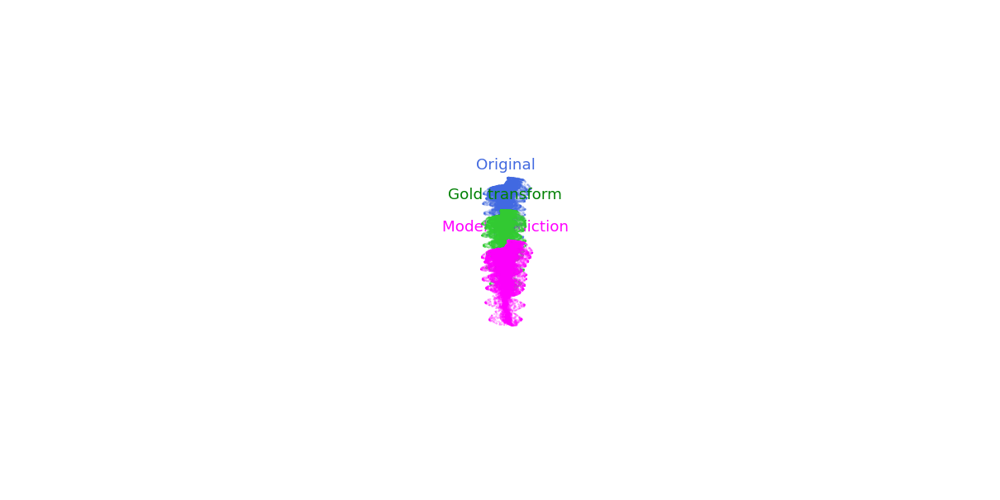

# Two-Stage Multimodal Pipeline for Orthodontic Treatment Planning

This folder contains the final two-stage pipeline used to predict per-tooth rigid movements from dentist instructions and 3D tooth geometry.

The pipeline combines:

1. LLM-based instruction interpretation
2. Relational multimodal movement prediction

The LLM is used to structure the clinical instruction. The neural model uses that structured signal together with tooth point clouds, tooth geometry, arch relationships, pairwise tooth relationships, and case metadata to predict final translations and rotations.

# Visualization 

<p align="center">
  
</p>

## 1. Folder Contents

| File or folder | Purpose |
|---|---|
| `contract.py` | Official task data structures, loading/saving utilities, FDI helpers, and quaternion utilities. |
| `parser.py` | Rule-based instruction parser used for baseline instruction features. |
| `dataloader.py` | Final standalone dataloader. Builds point-cloud, geometry, instruction, LLM, arch, spacing, and pairwise relational features. |
| `multimodal_tooth_model.py` | Relational multimodal neural model. Predicts tooth movement probability, translation, and quaternion rotation. |
| `main.py` | Training entry point. Performs patient-level train/validation split, trains the model, saves checkpoints. |
| `example_predict.py` | Inference entry point. Loads a trained checkpoint and writes task-plan JSON files. |
| `metrics.py` | Official scoring functions. |
| `score.py` | Official local scoring CLI. |
| `checkpoints_with_llm/` | Example trained checkpoint using LLM Stage-1 features. |
| `checkpoints_no_llm/` | Example trained checkpoint without LLM Stage-1 features. |

## 2. Stage 1: LLM Instruction Interpretation

Stage 1 is run before model training or inference. It converts each free-text clinical instruction into a validated `movement_plan.json` file inside each case folder.

The Stage-1 output contains:

- canonical clinical goals
- teeth expected to move
- teeth expected to stay fixed
- movement rationale for moved teeth
- confidence score

Example output:

```json
[
  {
    "id": "i0",
    "plan": {
      "goals": ["align_arch"],
      "move_teeth": [11, 12, 13, 21, 22, 23],
      "fixed_teeth": [16, 26],
      "movement_rationale": {
        "11": "anterior alignment"
      },
      "confidence": 0.8
    }
  }
]
```

The model does not blindly follow this output. Instead, the LLM output is used as a soft feature signal:

- LLM movable flag
- LLM fixed flag

The neural model can still override the LLM when the geometry and relational context suggest a different movement pattern.

## 3. Data Processing

The final dataloader is:

```text
starter/dataloader.py
```

It is standalone and reads the task files directly. It does not require a separate secondary dataloader.

For each case/instruction pair, it reads:

- `points.npz`
- `teeth.json`
- `meta.json`
- `instruction.txt` for train cases
- `instructions.json` for eval cases
- `gold_transforms.json` for train targets
- `movement_plan.json` for optional LLM Stage-1 features

The dataloader produces the original core fields:

- `points`
- `points_local`
- `geometry`
- `instruction_features`
- `meta_features`
- `target_translation`
- `target_rotation`
- `target_mask`
- `protected_mask`

It also produces relational features:

- `tooth_features`
- `pair_features`
- `jaw_index`
- `tooth_mask`
- `batch_tooth_mask`
- same-arch neighbor features
- opposite-arch neighbor features
- contralateral tooth features
- arch centerline features
- spacing and crowding features
- surface-distance features

### Tooth-Level Features

`tooth_features` include:

- tooth geometry summary
- parser instruction features
- LLM move/fixed features
- arch offset from fitted centerline
- arch tangent direction
- normalized arch position
- local spacing/crowding estimate
- contralateral partner information

### Pairwise Features

`pair_features` have shape `(T, T, pair_dim)` and describe directed relationships between every tooth pair.

They include:

- centroid delta vector
- centroid distance
- unit direction vector
- relative rotation representation
- surface distance between point clouds
- same-arch indicator
- opposite-arch indicator
- same-tooth indicator

These features allow the model to reason about tooth-to-tooth relationships, not just isolated teeth.

## 4. Model Architecture

The final model is defined in:

```text
starter/multimodal_tooth_model.py
```

The main class is:

```python
MultimodalToothMovementModel
```

The model receives one full case at a time with all teeth in the same batch item.

Inputs:

- `points_local`: per-tooth point clouds
- `tooth_features`: tabular geometry/instruction/spacing features
- `pair_features`: directed tooth-pair features
- `fdis`: tooth identities
- `jaw_index`: upper/lower arch identity
- `batch_tooth_mask`: valid tooth mask

Main components:

- point-cloud encoder
- tooth ID embedding
- jaw embedding
- tooth feature fusion layer
- pair-biased relational self-attention blocks
- movement classification head
- translation regression head
- quaternion rotation regression head

The model outputs:

- `move_logits`
- `move_probability`
- `translation`
- `rotation`

## 5. Training Objective

Training is handled by:

```text
starter/main.py
```

The loss combines:

- weighted binary cross-entropy for move/fixed classification
- Smooth L1 translation loss on moving teeth
- quaternion geodesic rotation loss on moving teeth
- immobility penalty on gold-fixed teeth
- protected-tooth penalty using parser and LLM protection features

Training uses a patient-level split:

- 40 training cases
- 10 validation cases
- default seed: `42`

This prevents instructions from the same patient appearing in both train and validation sets.

## 6. Stage-1 Commands

Run these from the repository root after generating or updating the Stage-1 LLM folder.

Generate LLM movement plans for train:

```bash
python "stage-1 LLM processing/generate_movement_plans.py" --root train
```

Generate LLM movement plans for eval:

```bash
python "stage-1 LLM processing/generate_movement_plans.py" --root eval
```

These commands write `movement_plan.json` into each case folder.

## 7. Training Commands

From the repository root:

```bash
python starter/main.py \
  --pack . \
  --epochs 100 \
  --batch-size 2 \
  --learning-rate 2e-4 \
  --checkpoints starter/checkpoints_with_llm
```

Train without LLM Stage-1 features:

```bash
python starter/main.py \
  --pack . \
  --epochs 100 \
  --batch-size 2 \
  --learning-rate 2e-4 \
  --no-llm-stage1 \
  --checkpoints starter/checkpoints_no_llm
```

Each checkpoint folder contains:

- `best.pt`
- `last.pt`
- `history.json`

## 8. Prediction Commands

Generate train predictions using the checkpoint trained with LLM features:

```bash
python starter/example_predict.py \
  --pack . \
  --split train \
  --checkpoint starter/checkpoints_with_llm/best.pt \
  --out submissions/train_predictions_with_llm
```

Generate train predictions using the checkpoint trained without LLM features:

```bash
python starter/example_predict.py \
  --pack . \
  --split train \
  --checkpoint starter/checkpoints_no_llm/best.pt \
  --out submissions/train_predictions_no_llm \
  --no-llm-stage1
```

Generate eval predictions for submission with the LLM-feature checkpoint:

```bash
python starter/example_predict.py \
  --pack . \
  --split eval \
  --checkpoint starter/checkpoints_with_llm/best.pt \
  --out submissions/eval_predictions_with_llm
```

Generate eval predictions for submission with the no-LLM checkpoint:

```bash
python starter/example_predict.py \
  --pack . \
  --split eval \
  --checkpoint starter/checkpoints_no_llm/best.pt \
  --out submissions/eval_predictions_no_llm \
  --no-llm-stage1
```

## 9. Evaluation Commands

Score the held-out train validation cases for the LLM-feature model:

```bash
python starter/score.py \
  --pack . \
  --plans submissions/train_predictions_with_llm
```

Score the held-out train validation cases for the no-LLM model:

```bash
python starter/score.py \
  --pack . \
  --plans submissions/train_predictions_no_llm
```

`starter/score.py` reproduces the same seed-42 patient-level validation split used during training, so it scores only the 10 held-out train cases. The public pack does not include eval gold, so eval predictions are intended for submission to the challenge organizers rather than local scoring.

## 10. Recommended Usage

For the standard two-stage run:

```bash
python "stage-1 LLM processing/generate_movement_plans.py" --root train
python "stage-1 LLM processing/generate_movement_plans.py" --root eval
python starter/main.py --pack . --epochs 100 --batch-size 2 --learning-rate 2e-4 --checkpoints starter/checkpoints_with_llm
python starter/example_predict.py --pack . --split eval --checkpoint starter/checkpoints_with_llm/best.pt --out submissions/predictions
```

For a no-LLM ablation:

```bash
python starter/main.py --pack . --epochs 100 --batch-size 2 --learning-rate 2e-4 --no-llm-stage1 --checkpoints starter/checkpoints_no_llm
python starter/example_predict.py --pack . --split eval --checkpoint starter/checkpoints_no_llm/best.pt --out submissions/predictions --no-llm-stage1
```

## 11. Notes

- The LLM is used as an instruction prior, not as the final authority.
- The neural model predicts the final movement probability, translation, and rotation.
- Teeth predicted as fixed are assigned the identity transform.
- All output plans follow the official `taskplan-1` format through `contract.save_plan()`.

## 12. Writeup (Answers to asked questions)

### Describe your model architecture and why you chose it.
I built a two-stage instruction-conditioned treatment-planning pipeline.

The first stage is an LLM-based instruction interpreter. It reads the dentist’s free-text prescription and converts it into a structured `movement_plan.json` containing clinical goals, teeth expected to move, teeth expected to remain fixed, tooth-level rationale, and confidence. I chose this because the instruction text is clinically nuanced: phrases like “upper arch only,” “leave the lower arch untouched,” or “do not move 4.5 and 4.6” are difficult to capture reliably with simple keyword rules. The LLM output is validated with a Pydantic schema before it is used, so malformed tooth numbers, duplicate teeth, or inconsistent move/fixed assignments are rejected.

The second stage is a relational multimodal neural network. For each case, the model receives the full set of teeth together, not one tooth in isolation. Each tooth is represented using several inputs: its local point cloud, geometric summary features, FDI identity, jaw identity, instruction features, LLM-derived move/fixed features, arch-position features, spacing/crowding estimates, contralateral-tooth information, and pairwise relationship features to every other tooth.

The model has four main parts:

i. **Point-cloud encoder**  
   A shared PointNet-style encoder processes each tooth’s local point cloud. It extracts learned shape information from the tooth geometry while remaining lightweight enough for the small dataset.

ii. **Tooth and instruction feature fusion**  
   Hand-engineered tooth features, parser features, LLM Stage-1 features, FDI embeddings, and jaw embeddings are concatenated and projected into a shared latent representation. This lets the model combine geometry, clinical language, and tooth identity.

iii. **Pair-biased relational attention**  
   The core architectural choice is a relational self-attention block. Unlike a model that predicts each tooth independently, this layer allows every tooth to attend to every other tooth using pairwise features such as centroid distance, direction, same/opposite arch identity, relative orientation, surface distance, local spacing, and contralateral relationships. I chose this because orthodontic treatment planning is inherently relational: moving one tooth affects its neighbours, opposing teeth, arch shape, spacing, and collision risk.

iv. **Multi-head outputs**  
   The model predicts three outputs per tooth:
   - a movement probability (`move_probability`)
   - a 3D translation vector
   - a normalized quaternion rotation

This separation is intentional. Many teeth should remain fixed, so asking a single regression head to learn both “no movement” and meaningful movement is inefficient. The movement head first learns whether a tooth should move; the translation and rotation heads then learn the magnitude and direction of movement.

The training loss mirrors the task requirements. It combines weighted move/fixed classification, translation loss, quaternion geodesic rotation loss, an immobility penalty for gold-fixed teeth, and an additional protected-tooth penalty based on parser/LLM protection signals. I chose this because raw endpoint accuracy is not enough in a clinical planning task: moving a tooth that should be fixed is a serious constraint violation.

Overall, I chose this architecture because it balances three needs: understanding clinical language, learning from 3D tooth geometry, and modelling relationships across the whole dentition. The LLM captures explicit instruction intent; the relational neural model learns implicit geometric and arch-level movement patterns.

Updated todo list

### How does your prototype turn (geometry, text) into plans - and how does the text actually steer the output?

The prototype converts each case into a standard task-plan JSON through a two-stage process.

First, the dentist’s instruction is passed through the Stage-1 LLM interpreter. The LLM does not directly predict final tooth positions. Instead, it converts the free-text instruction into structured clinical intent: canonical goals, teeth that appear movable, teeth that appear protected or fixed, and rationale. This output is saved as `movement_plan.json` and validated with a Pydantic schema to ensure valid FDI tooth numbers and consistent move/fixed assignments.

Second, the neural model receives both the 3D geometry and the structured instruction features. For each tooth, the dataloader builds:

- a local point cloud from `points.npz`
- geometric features from `teeth.json`
- FDI and jaw identity
- parser-derived instruction features
- LLM-derived move/fixed features
- arch position, spacing, crowding, contralateral, and pairwise tooth-relation features

The model processes this full case at once. It uses the point cloud to learn tooth shape, the geometric features to understand tooth position and orientation, and the pairwise features to understand how teeth relate to neighbouring and opposing teeth. It then predicts, for every tooth:

- probability that the tooth should move
- translation vector in millimetres
- rotation as a normalized quaternion

At inference time, if the model’s movement probability is below threshold, the tooth is assigned the identity transform. If it is above threshold, the predicted translation and quaternion are written into the final task-plan JSON.

### How the Text Steers the Output

The text steers the output in two ways: explicitly through the LLM and parser features, and implicitly through training.

The parser extracts rule-based features such as arch scope, protected teeth, region, objective priority, refinement/staging hints, and whether the tooth is covered by a movement goal. These become per-tooth instruction features.

The LLM adds a second text signal. It interprets more complex clinical language and marks teeth as likely movable or fixed. For example:

- “upper arch only” makes lower teeth strong fixed candidates
- “leave lower untouched” increases the fixed signal for all lower teeth
- “align anterior teeth” increases the movement signal for incisors/canines
- “do not move 4.5 and 4.6” marks those specific teeth as protected
- “comprehensive correction” expands the movement prior across the relevant arch

These text-derived features are concatenated with the geometry features for every tooth. The model therefore sees not just the tooth’s shape and position, but also whether the instruction says this tooth is in scope, protected, or likely to move.

The model is trained against the actual gold transforms. During training, it learns how text cues should affect movement patterns. For example, if the same kind of geometry appears with an “upper only” instruction, the model learns to keep lower teeth fixed. If the instruction implies full-arch alignment, it learns that movement may be coordinated across more teeth than just those explicitly named.

I deliberately treat the LLM output as a soft signal rather than an irreversible hard gate. This matters because the LLM can misclassify teeth, especially when real clinical plans include small compensating movements not explicitly mentioned in the instruction. By feeding the LLM result as a feature instead of forcing its decision, the model can still override it when the geometric and relational context suggests movement.

The final plan is therefore produced by combining:

- explicit text interpretation
- tooth-level geometry
- arch and pairwise relationships
- learned movement patterns from gold treatment plans

This is how the prototype ensures that the instruction text genuinely affects which teeth move and which stay fixed, rather than simply predicting an average geometry-driven plan.
