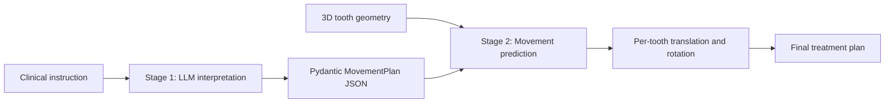

## Professional Project Plan: LLM-Guided Orthodontic Treatment Planning

### 1. Objective

Develop a pipeline that converts:

- Dentist’s free-text orthodontic instructions
- 3D tooth geometry

into validated, per-tooth rigid movements using:

- Translation in millimetres
- Rotation as unit quaternions
- FDI tooth numbering

The system must correctly identify which teeth should move and which should remain fixed.

### 2. Overall Architecture

### 3. Stage 1: LLM Instruction Interpretation

The LLM reads the dentist’s instruction and produces structured JSON containing:

- Clinical goals
- `move_teeth`
- `fixed_teeth`
- Movement rationale
- Confidence score

The output is validated using Pydantic to ensure:

- Only valid FDI numbers are used
- Teeth are not duplicated
- A tooth cannot be both moved and fixed
- Every moved tooth has a rationale
- Confidence is between 0 and 1

The interpreter also supports:

- OpenAI-compatible LLM endpoints
- Retry handling for invalid responses
- Few-shot examples from the training set
- Processing all instructions in a case folder
- Saving `movement_plan.json` for every case

The prompt was improved so that whole-arch and comprehensive instructions include coordinated movement across the relevant arch, while explicitly protected teeth remain fixed.

### 4. Stage 2: Neural Movement Prediction

The neural model receives one complete case per batch element.

Its inputs include:

- Raw tooth point clouds
- Tooth-local point clouds
- Geometric features
- Parser-based instruction features
- LLM-derived move/fixed features
- Case metadata

The model contains:

- Point-cloud encoder using `Conv1d` layers and max pooling
- Geometry encoder using fully connected layers
- Instruction encoder
- Case-metadata encoder
- Feature-fusion network
- Translation prediction head
- Quaternion rotation prediction head

A lightweight cross-tooth self-attention layer was also tested to allow teeth to exchange information within the same case.

### 5. Training Improvements

The training pipeline was enhanced with:

- Gold-derived immobility masks
- Immobility penalty for incorrectly moving fixed teeth
- Collision penalty for adjacent teeth becoming too close
- Random yaw rotation and point-cloud jitter augmentation
- Reproducible patient-level train/validation splitting
- Configurable learning rate and loss weights

The training and validation split uses:

- 40 training cases
- 10 held-out validation cases
- Seed `42`

### 6. Alternative Machine-Learning Methods

Two Random Forest approaches were tested:

1. Single multi-output Random Forest regressor
2. Two-stage Random Forest:
   - Classifier predicts whether a tooth moves
   - Regressor predicts movement for teeth classified as movable

The single Random Forest achieved slightly better endpoint accuracy on the held-out cases, but the neural model achieved better safety-related metrics.

The two-stage Random Forest performed worse because hard binary classification can incorrectly freeze teeth that need movement.

### 7. Evaluation Metrics

The following metrics were used:

- Mean translation error in millimetres
- Mean rotation error in degrees
- Percentage of teeth within `0.5 mm` and `2°`
- Immobility violation rate
- Worst predicted penetration
- Number of colliding adjacent tooth pairs

The held-out validation set is the preferred comparison because those cases were not used to update model weights.

### 8. Main Experimental Findings

The strongest balanced full-training result was:

- Translation error: `0.626 mm`
- Rotation error: `7.23°`
- Within tolerance: `34.4%`
- Immobility violations: `0.0%`
- Worst penetration: `0.662 mm`
- Colliding pairs: `11`

Configuration:

- Learning rate: `1e-3`
- Epochs: `100`
- Immobility weight: `0.35`
- Collision weight: `0.12`

The best endpoint-focused result was:

- Translation error: `0.568 mm`
- Rotation error: `6.64°`
- Within tolerance: `34.6%`

However, it produced more collisions and slightly higher immobility violations, so it was not selected as the preferred balanced model.

### 9. Effect of the LLM Stage

Before retraining, the LLM stage reduced the final pipeline’s immobility violations from:

- `14.3%` to `2.0%`

After retraining the neural model with gold-derived immobility loss, the final pipeline reached:

- `0.0%` immobility violations

On the held-out validation cases, the LLM gate and no-LLM version produced almost identical results. This suggests that the retrained neural model learned much of the fixed-tooth behavior itself.

The LLM remains valuable as:

- A structured instruction parser
- A source of explicit clinical features
- A safety and interpretability layer
- A mechanism for handling complex arch-scope instructions

### 10. Recommended Final Pipeline

Use the following configuration as the current preferred approach:

1. LLM interprets the clinical instruction.
2. Pydantic validates the movement plan.
3. LLM-derived move/fixed information is included as model features.
4. The neural model predicts per-tooth movements.
5. Immobility and collision constraints are applied during training.
6. Fixed or protected teeth are forced to identity transforms at inference.
7. The final plan is saved using the required task format.

### 11. Limitations and Future Improvements

The main limitation is the small dataset:

- Only 50 training cases
- Only 10 held-out validation cases
- Hidden evaluation gold is unavailable locally

The next major improvements should come from:

- More labeled treatment plans
- Better text embeddings instead of manually engineered instruction features
- Richer cross-tooth and opposing-arch relationships
- Clinically informed collision and contact losses
- Multiple validation splits or cross-validation
- More robust calibration of LLM move/fixed confidence

The current results indicate that the balanced neural model is the most sensible final direction, while the Random Forest and attention experiments provide useful evidence about the strengths and limitations of alternative approaches.
